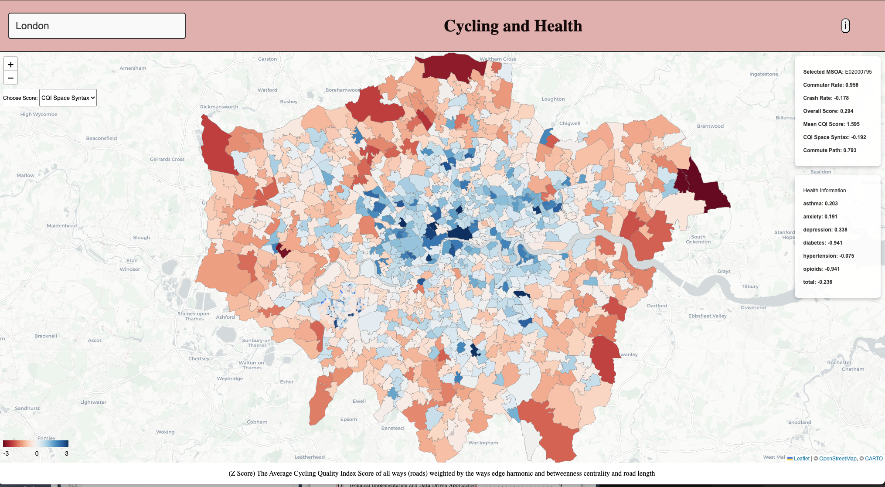

# Pedal-Powered Health: The Interplay Between Urban Cycling Infrastructure and Public Health

# About
Urban planners and public health officials are increasingly investing in cycling infrastructure to promote
sustainable transportation and improve population health.
However, the uneven distribution of biking amenities - such as varying quality bike lanes, shared-use
paths, and bike-share stations - is problematic as it may exacerbate existing health disparities.
This project examines the local relationship between cycling infrastructure and usage and their
impact on health outcomes, aiming to understand how access to cycling resources influences community
well-being.

# Viewable at: https://pooley3100.github.io/cycling-medsat/

## DEMO Sheffield

To test the software without having to run QGIS, the files for Sheffield are provided
1) Ensure working directory set to within cycling-medsat-main
2) Run run.py and can delete Score Scripts/SheffieldDatasets/Sheffield_msoa_scores.csv to see score re-creation, will need ODWP01EW_MSOA (see point 3 To Run) downloaded however for commute path score.

# Todo's to FULLY run
To use run.py, this should run the user through the steps required to creat a cycling & health map for the region

## To Run -> Need To Install First:
1) QGIS: https://qgis.org/
2) MedSat point_data folder: https://dataserv.ub.tum.de/index.php/s/m1714817.rep   and replace in MedSat/point-data folder
3) Origin Destination Census Data: https://www.nomisweb.co.uk/sources/census_2021_od, file OODWP01EW, unzip then place ODWP01EW_MSOA.csv in the folder Score Scripts/Commute Route/
4) Venv with requirements.txt

## Steps user will need to take to create new Region

1) Running Overpass turbo (https://overpass-turbo.eu/) on desired region (creating a BBOX boundary), potentially in sub boxes if big (i.e London) and adding the Region name to config.py with the path name to the folder with overpass geojson boxe(s) result in within the Datasets folder. Example can be seen Score Scripts/QueryManchesterOSM.txt for Overpass Script.
2) Run.py <--- CORE
2) Requires manually running OSM-Cycling-Quality-Index [https://www.osm-verkehrswende.org/cqi/] (UK edited script)(REMOVE MPH MANUALLY) in QGIS, read README within file, script modified for UK but ALL Accreditation goes to osm-verkehrswende. Essentially download [https://qgis.org/], load OSM-Cycling-Quality-Index folder, then load cycling_quality_index.py into the QGIS python scripts editor, make sure way_import.geojson, with mph removed is in data folder of OSM-Cycling-Quality-Index, created by run.py is placed in data sub directory, then run the python file cycling_quality_index.py in QGIS.
3) Creating {Region}MSOA.csv region file for desired region, this file is created but needs to be filled in by the user so the program knows which MSOA boundaries to include, look at other Dataset files for an idea. (i.e. LondonMSOA.csv)
4) Scores should be created now and DONE, to visualise edit top of index.js to include new location front-end.

Results = msoa_scores csv file, medsat_msoa_scores.csv file. AND boundary output_jsons_msoa file with msoa broken down into way scores.

## Cycling Score Metrics by MSOA:

All scores are stored in msoa_scores.csv and then Z-based normalized are stored in msoa_scores_zscaled.csv for each dataset:
1) Overall Cycle Score (OverallCycleScore)    <-- Created in Score Scripts/OverallCycleScore.py
2) Commuter Rate %                            <-- Created in Score Scripts/CommuteRate/CalculateCommuteMSOA.py
3) Crash Rate                                 <-- Created in Score Scripts/CrashRate/CalculateCrashMSOA.py
4) CQI Threshold - % over 55 score (ScoreCQI) <-- Created in Score Scripts/CQI/AddMSOAtoCQI.py and added in Score Scripts/CQI/AddThresholdScores.py
5) CQI Mean Score (ScoreCQIMean)              <-- Created in Score Scripts/CQI/MSOAAverageCQIScore.py
6) CQI Mean and weighted by road length (index_length)   <-- Created in Score Scripts/SpaceSyntax and Length/spacesyntax.py and added in Score Scripts/SpaceSyntax and Length/updateMSOA.py
7) CQI Mean weighted by space syntax (index_space_syntax)   <-- Created in Score Scripts/SpaceSyntax and Length/spacesyntax.py and added in Score Scripts/SpaceSyntax and Length/updateMSOA.p
8) CQI Mean weighted by space syntax and road length (CQI Space Syntax)(index_space_syntax_length) <-- Created in Score Scripts/SpaceSyntax and Length/spacesyntax.py and added in Score Scripts/SpaceSyntax and Length/updateMSOA.p
9) Commute Path (commute_path)- Average CQI Space Syntax, Commute Rate, Crash Rate along most popular commute route  <-- Created in Score Scripts/Commute Route/path.py

## Health Metrics by MSOA:
OME,anxiety,asthma,depression,diabetes,hypertension,opioids,total

## Cities currently included
London, Birmingham, Leeds, Liverpool, Sheffield, Manchester, Bristol

## Data Storage
Where Region = i.e. London
1) All cycling metrics are stored in Score Scripts/{Region}Datasets
2) All Healh scores are stored in MedSat/{Region}
3) All MSOA Street Level Scores are stored in Datasets/{Region}_cqi_jsons_msoa_REDUCED

## All analysis other than choropleth maps (index.js) are done in Models folder
1) DescComp = more City wide average statistics
2) CorrAnalysis = Pearson Correlations by City and All cities, plus predictor vs predictor analysis
3) Regression = regressionSingle + regressionMultiple + plotCoef creates coefficient plot as seen in the paper figure 13
4) Confound = correlations when median income of MSOA included.

